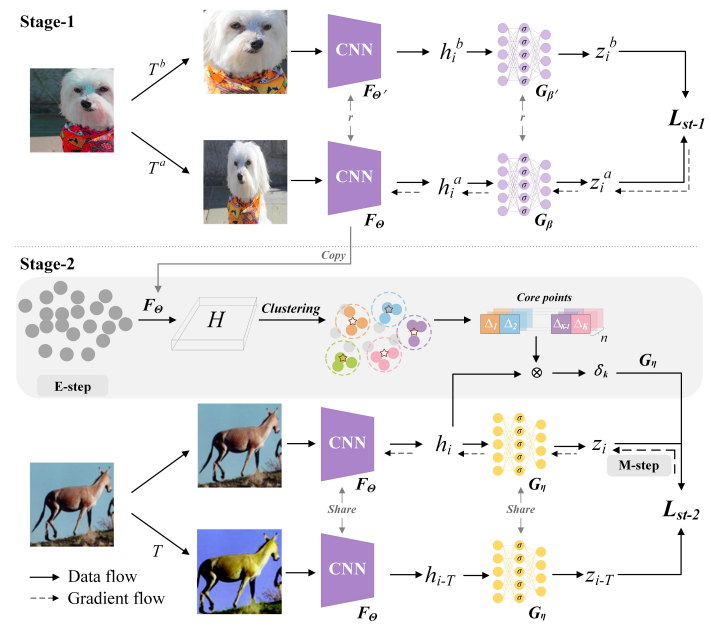

## Combining Core Points and Cluster-level Semantic Similarity for Self-supervised Clustering

!

This is a PyTorch implementation 

### Our Method
We have constructed a new clustering method CPCS based on MoCoV2
